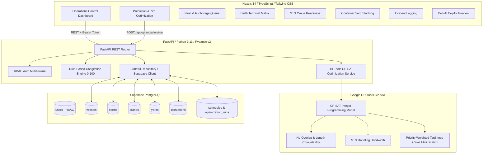

# NaviOps System Architecture

## 1. System Architecture Overview

NaviOps is an industrial-grade Maritime Operations & Decision-Support Platform designed for commercial container and multi-purpose port terminals. It decouples the operational telemetry plane from the combinatorial mathematical optimization engine, ensuring predictable and deterministic port scheduling before Phase 2 agentic AI layers are integrated.

---

## 2. Core Components

| Component | Technology | Responsibility |
|---|---|---|
| **Frontend Application** | Next.js 14 (App Router), TypeScript, Tailwind CSS | Enterprise light-theme command center with 9 modules, data-dense tables, 72h Gantt schedule, and dialog modals. |
| **Backend API Gateway** | Python 3.11, FastAPI, Pydantic v2, Uvicorn | Async REST endpoints with strict schemas, CORS handling, error handling, and RBAC authorization dependencies. |
| **Optimization Engine** | Google OR-Tools (CP-SAT solver) | Formulates and solves the 72-hour berth allocation and crane scheduling problem under combinatorial constraints. |
| **Congestion Engine** | Python rule-based scoring module | Computes transparent Port Congestion Index (0–100) factoring queue ratios, resource saturation, and disruption severity. |
| **Persistence Layer** | Supabase PostgreSQL + Fallback Repository | Relational storage with foreign keys, indexes, and synthetic seed datasets for offline hackathon reliability. |

---

## 3. Google OR-Tools CP-SAT Formulation

### Horizon & Time Slots:
- Horizon: Next 72 hours divided into 1-hour discrete intervals ($t \in [0, 72]$).

### Decision Variables:
- $B_{v, b} \in \{0, 1\}$: Binary variable indicating if vessel $v$ is allocated to berth $b$.
- $Start_v \in [ETA_v, 72]$: Integer variable for berthing start time.
- $Duration_{v, b}$: Calculated service duration based on cargo volume and assigned crane moves/hr.
- $End_v = Start_v + Duration_{v, b}$.
- $Interval_{v, b}$: Optional interval variable active when $B_{v, b} = 1$.

### Mathematical Constraints:
1. **Single Berth Allocation**: $\sum_{b \in Compatible(v)} B_{v, b} = 1$.
2. **Physical Compatibility**: $B_{v, b} = 0$ if $Length_v > MaxLength_b$.
3. **No Berth Overlap (No Collision)**: `model.AddNoOverlap(intervals_for_berth[b])`.
4. **Disruption & Maintenance Inactivity**: Berths and cranes under maintenance or failure cannot accept intervals during disruption windows.
5. **Earliest Arrival Time**: $Start_v \ge \max(ETA_v, BerthAvailableFrom_b)$.

### Objective Function:
$$\min \sum_{v} \left( w_{\text{priority}}(v) \cdot (Start_v - ETA_v) + \alpha \cdot \max(0, End_v - ETD_v) \right)$$
- Priority 1 (Critical): $5\times$ weight
- Priority 2 (High): $3\times$ weight
- Priority 3 (Standard): $2\times$ weight
- Priority 4 (Low): $1\times$ weight

---

## 4. Role-Based Access Control (RBAC) Matrix

| Operation / Endpoint | Port Manager / Admin | Operations Staff | Viewer / Executive |
|---|:---:|:---:|:---:|
| View Dashboards & KPIs | Allowed | Allowed | Read-Only |
| Create / Edit Operational Records | Allowed | Allowed | Restricted (403) |
| Delete Operational Records | Allowed | Restricted (403) | Restricted (403) |
| Report Disruptions & Incidents | Allowed | Allowed | Restricted (403) |
| Trigger 72h Optimization Run | Allowed | Allowed | Restricted (403) |
| Approve & Apply Optimization Plan | Allowed | Restricted (403) | Restricted (403) |

---

## 5. Phase 2 Agentic Architecture Integration

The Phase 1 normal operational build provides stable REST contracts ready for Phase 2 LangGraph agent workflows:
1. **Monitoring Agent**: Polls `/api/dashboard/congestion` every 60s; detects bottleneck anomalies.
2. **Impact Analysis Agent**: Evaluates downstream delays on vessels when crane or berth disruptions occur.
3. **Optimization Agent**: Invokes `/api/optimization/run` to generate updated schedules.
4. **Evaluation Agent**: Compares baseline delays vs. optimized schedule metrics.
5. **Bob Copilot**: Presents recommended recovery schedules to human Port Managers for approval.
